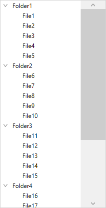

# How to change the width of the vertical scrollbar in WPF TreeView (SfTreeView)?

## About the sample

This sample illustrates how to change the width of the vertical scrollbar in WPF TreeView.

[WPF TreeView](https://www.syncfusion.com/wpf-controls/treeview) (SfTreeView), doesn’t have any direct property to change the width of the vertical scrollbar. However, you can change it by increasing the width of the ScrollViewer in the SfTreeView template by creating Style with TargetType as SfTreeView.

```XAML

<Window.Resources>
    <DataTemplate x:Key="endExpanderTemplate">
        <Grid x:Name="grid" 
          Width="{TemplateBinding Width}"
          Background="Transparent" >
            <Path x:Name="PART_CollapseCellPath"
              Width="6.061"
              Height="8.706"
              Data="M5.6040074,0 L6.2710001,0.74499984 1.5000009,5.0119996 6.2529947,9.2629985 5.5860021,10.007999 0,5.0119996 z"
              Stretch="Uniform"
              Fill="#6D6D6D" />
            <Path x:Name="PART_ExpanderCellPath"
              Width="8.706"
              Height="6.061" 
              Data="M0.74499548,0 L5.0119957,4.7700001 9.2630047,0.017000169 10.008001,0.68400005 5.0119957,6.2700001 0,0.66699985 z"
              Stretch="Uniform"
              Fill="#6D6D6D"/>
        </Grid>
        <DataTemplate.Triggers>
            <DataTrigger Binding="{Binding IsExpanded}" Value="True">
                <Setter Property="Visibility" TargetName="PART_ExpanderCellPath" Value="Visible"/>
                <Setter Property="Visibility" TargetName="PART_CollapseCellPath" Value="Collapsed"/>
            </DataTrigger>
            <DataTrigger Binding="{Binding IsExpanded}" Value="False">
                <Setter Property="Visibility" TargetName="PART_ExpanderCellPath" Value="Collapsed"/>
                <Setter Property="Visibility" TargetName="PART_CollapseCellPath" Value="Visible"/>
            </DataTrigger>
        </DataTemplate.Triggers>
    </DataTemplate>

    <Style TargetType="syncfusion:SfTreeView" x:Key="SfTreeViewStyle_ScrollBarWidth">
        <Setter Property="Template">
            <Setter.Value>
                <ControlTemplate TargetType="syncfusion:SfTreeView">
                    <Grid Background="{TemplateBinding Background}">
                        <Border Background="{TemplateBinding Background}"
                            BorderBrush="{TemplateBinding BorderBrush}"
                            BorderThickness="{TemplateBinding BorderThickness}"
                            SnapsToDevicePixels="True">
                            <ScrollViewer x:Name="PART_ScrollViewer" 
                                  Background="Transparent"
                                  CanContentScroll="True"
                                  IsTabStop="False" 
                                      FlowDirection="{TemplateBinding FlowDirection}"
                                      HorizontalScrollBarVisibility="{TemplateBinding ScrollViewer.HorizontalScrollBarVisibility}"
                                      IsDeferredScrollingEnabled="{TemplateBinding ScrollViewer.IsDeferredScrollingEnabled}"
                                      PanningMode="{TemplateBinding ScrollViewer.PanningMode}"
                                      PanningRatio="{TemplateBinding ScrollViewer.PanningRatio}"
                                  VerticalScrollBarVisibility="{TemplateBinding ScrollViewer.VerticalScrollBarVisibility}">
                                <syncfusion:TreeNodeContainer x:Name="PART_TreeNodeContainer"
                                                 HorizontalAlignment="Left"
                                                 Background="Transparent"/>
                                <ScrollViewer.Resources>
                                    <sys:Double x:Key="{x:Static SystemParameters.VerticalScrollBarWidthKey}">50</sys:Double>
                                </ScrollViewer.Resources>
                            </ScrollViewer>
                        </Border>
                    </Grid>
                    <ControlTemplate.Triggers>
                        <Trigger Property="ExpanderPosition" Value="End">
                            <Setter Property="ExpanderTemplate" Value="{StaticResource endExpanderTemplate}"/>
                        </Trigger>
                    </ControlTemplate.Triggers>
                </ControlTemplate>
            </Setter.Value>
        </Setter>
    </Style>
</Window.Resources> 


```



KB article - [How to change the width of the vertical scrollbar in WPF TreeView (SfTreeView)?](https://www.syncfusion.com/kb/12526/how-to-change-the-width-of-the-vertical-scrollbar-in-wpf-treeview-sftreeview)

## Requirements to run the demo

Visual Studio 2015 and above versions
